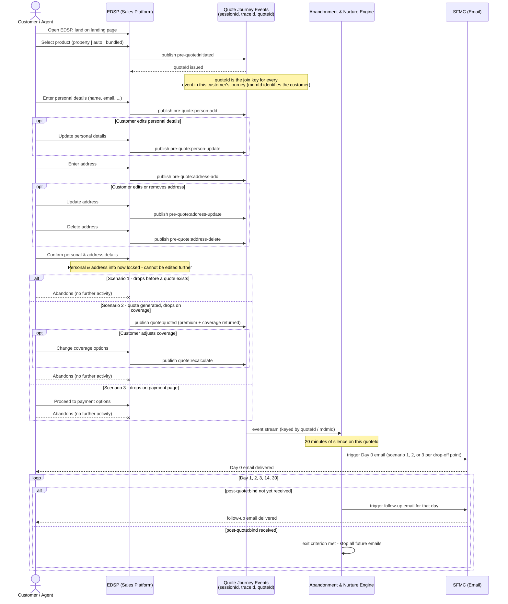
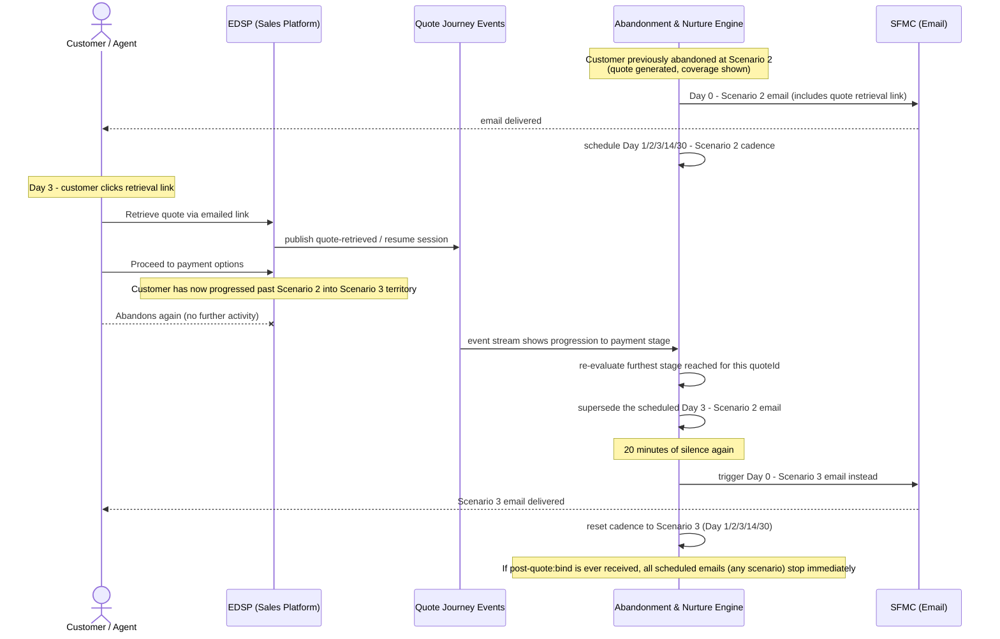

# EDSP Abandoned Quote Recovery — Use Case Documentation

**System:** EDSP (insurance sales platform)
**Use case:** Detect abandoned insurance applications (property / auto / bundled) and automatically recover them via a stage-aware, multi-touch email nurture campaign in Salesforce Marketing Cloud.
**Scope note:** The UI and event instrumentation described below already exist. This document covers the marketing automation capability that consumes those events — detection, segmentation, journey orchestration, and governance.

---

## 1. Event Model (as described)

| Event | Fired when | Carries |
|---|---|---|
| `pre-quote:initiated` | Customer/agent selects a product and starts an application | new `quoteId` |
| `pre-quote:person-add` | Personal details entered | `quoteId`, `sessionId`, `traceId`, `mdmId` |
| `pre-quote:person-update` | Personal details edited | same |
| `pre-quote:address-add` | Address entered | same |
| `pre-quote:address-update` | Address edited | same |
| `pre-quote:address-delete` | Address removed | same |
| *(unnamed)* | Personal & address info confirmed — locks both sections | — |
| `quote:quoted` | Quote generated — premium + coverage returned | `quoteId` |
| `quote:recalculate` | Customer adjusts coverage, new premium generated | `quoteId` |
| *(unnamed)* | Customer proceeds to payment-options page | — |
| `post-quote:bind` | Policy bound | `quoteId` |

**Identifiers:**
- `quoteId` — join key across every event in one application attempt
- `sessionId`, `traceId` — session/request correlation
- `mdmId` — master customer record; one customer can have multiple quoteIds (multiple attempts/products) that all roll up to the same `mdmId`

**Two events above are unnamed in the source system as of this writing** — the confirm/lock step and the move-to-payment step. Acceptance criteria referencing them should be finalized once real event names are confirmed.

---

## 2. Abandonment Scenarios

Classification is by **furthest stage reached**, not just the most recent event:

| Scenario | Furthest stage reached | Signal |
|---|---|---|
| **1 — Early Interest** | Personal/address entry, no quote yet | Dropped before `quote:quoted` |
| **2 — Priced & Considering** | Quote generated, coverage shown/adjusted | `quote:quoted` (± `quote:recalculate`) occurred, payment not reached |
| **3 — High Intent / Near-Miss** | Reached payment options | Proceeded to payment page, no `post-quote:bind` |

**Exit criterion (all scenarios):** `post-quote:bind` — stop every scheduled send immediately.

---

## 3. Sequence Diagrams

### 3.1 Main journey — three abandonment points, Day-0 trigger, nurture cadence

### 3.2 Re-engagement & scenario re-classification

---

## 4. Capability: Abandoned Quote Recovery — Lifecycle Marketing Automation

**Capability statement:** As EDSP Marketing, we want to automatically recover revenue from customers who start but don't finish an insurance application — by detecting abandonment in real time, segmenting by purchase intent, and running a personalized multi-touch journey that stops the instant they convert — so we lift bind rate without adding manual outreach load on sales or agents.

**KPIs this capability should move:**
- **Abandonment recovery rate** — % of abandoned quotes that bind after entering the journey (north star)
- **Recovered premium / revenue attributed** to the campaign
- **Email engagement** (open, click) per scenario and per cadence day
- **Time-to-recovery** — days from abandonment to bind
- **Unsubscribe/complaint rate** — deliverability health guardrail
- **Incremental lift vs. holdout** — proves the campaign *causes* recovery, not just correlates with customers who'd have returned anyway

### Feature map

| # | Feature | Priority |
|---|---|---|
| 1 | Real-time abandonment signal detection | Must |
| 2 | Purchase-intent segmentation (scenario classification) | Must |
| 3 | Entry-triggered journey orchestration (SFMC Journey Builder) | Must |
| 4 | Multi-touch cadence with marketer-configurable wait activities | Must |
| 5 | Dynamic content personalization | Must |
| 6 | Conversion-based exit criteria (bind suppression) | Must |
| 7 | Consent, compliance & frequency governance | Must — non-negotiable |
| 8 | Re-entry & journey path switching | Should |
| 9 | Attribution, reporting & holdout measurement | Should |
| 10 | A/B testing & send optimization | Could |
| 11 | High-value lead escalation to an agent | Could |

### Feature 1 — Real-Time Abandonment Signal Detection
*As Marketing, I want to know within minutes that a customer has gone quiet, so recovery outreach happens while intent is still warm.*

- **Given** an open, unbound quote, **when** 20 minutes pass with no further activity, **then** an abandonment signal fires for that quoteId.
- **Given** activity resumes before 20 minutes, **then** no signal fires and the clock resets.
- *Marketing value:* real-time beats batch — recovery-email conversion drops sharply the longer the delay between abandonment and first touch.

### Feature 2 — Purchase-Intent Segmentation (Scenario Classification)
*As Marketing, I want abandoners segmented by how far they got, so a "just started" browser gets very different messaging from someone who saw their exact premium and almost paid.*

- **Given** no quote generated yet, **then** segment = **Scenario 1 (Early Interest)**.
- **Given** a quote/coverage was shown, **then** segment = **Scenario 2 (Priced & Considering)**.
- **Given** the customer reached payment, **then** segment = **Scenario 3 (High Intent / Near-Miss)**.
- *Marketing value:* Scenario 3 messaging should feel urgent and frictionless ("your $X/month rate is still available"); Scenario 1 should feel low-pressure ("still comparing options?").

### Feature 3 — Entry-Triggered Journey Orchestration (SFMC Journey Builder)
*As Marketing, I want abandonment to trigger entry into a Journey Builder journey — not a hardcoded email send — so I can iterate on timing, content, and logic myself without an engineering ticket.*

- **Given** an abandonment signal + segment, **when** it fires, **then** a Track Event call enrolls the `mdmId`/quoteId into the corresponding Journey (Scenario 1/2/3 entry event).
- **Given** the journey is live, **then** marketing owns the email content, subject lines, and wait-step timing entirely within Journey Builder.
- *Marketing value:* decouples "when/what we send" (marketing's job) from "whether someone abandoned" (engineering's job).

### Feature 4 — Multi-Touch Cadence with Configurable Wait Activities
*As Marketing, I want a Day 0/1/2/3/14/30 cadence I can tune, so the recovery window matches real buying behavior instead of a guess baked into code.*

- **Given** Day 0 sends and no bind, **then** the journey holds at each wait activity (Day 1/2/3/14/30) and sends the next scenario-matched touch.
- **Given** cadence timing needs to change, **then** marketing can edit wait activities directly in Journey Builder — no redeploy.
- **Given** Day 30 completes with no bind, **then** the journey ends (or hands off — see Feature 11) with no further automated sends.

### Feature 5 — Dynamic Content Personalization
*As a customer, I want the recovery email to reflect exactly where I left off — my product, my quoted premium, my coverage — so it feels like a helpful nudge, not spam.*

- **Given** Scenario 2 or 3, **then** the email includes the actual quoted premium, coverage summary, and a one-click resume link to that quoteId.
- **Given** Scenario 1, **then** the email references the product type selected, with no fabricated quote details.
- **Given** the customer's name is known, **then** it's used in the subject line/greeting.

### Feature 6 — Conversion-Based Exit Criteria (Bind Suppression)
*As a customer who already bought, I don't want to keep getting "finish your application" emails.*

- **Given** `post-quote:bind` fires for a quoteId, **then** exit criteria trigger immediately and remove that contact from all active journey paths for it.
- **Given** a send was already queued at the moment of bind, **then** it's suppressed on a best-effort basis before delivery.

### Feature 7 — Consent, Compliance & Frequency Governance
*As the business, I need every send to respect opt-outs and frequency limits — today enforced natively in SFMC, with an eye toward a future central consent authority so this doesn't need to be re-architected when that lands.*

- **Given** a customer has unsubscribed (via SFMC's Subscriber/Publication List status or equivalent), **then** they never enter or continue in the abandonment journey — enforced by SFMC's native subscription check at journey entry and at each send.
- **Given** a customer is concurrently in another active journey, **then** frequency-capping/quiet-hours rules (SFMC Send Classification / Delivery Profile settings) prevent over-messaging.
- **Given** any send, **then** it includes the required unsubscribe/compliance footer.
- **Architectural note:** consent is currently managed natively in SFMC. There's an active discussion about moving consent to a central location. The Track Event call that enrolls a contact (Feature 3) should treat "check consent" as a single, named step — currently satisfied by SFMC's own subscription-status check — rather than assuming SFMC *is* the consent authority throughout the design. That's what makes the eventual swap to a central consent service a config/integration change, not a re-architecture.
- **Watch item (not this sprint):** when the central consent location is decided, this capability needs a follow-up feature to move the "is this contact allowed to receive this journey" check from SFMC-native subscription status to a call against the central service — likely a pre-entry API gate before the Track Event fires, so SFMC never attempts entry for a non-consented contact. Flag this capability as a downstream consumer to whoever owns that decision.

### Feature 8 — Re-Entry & Journey Path Switching *(Should)*
*As Marketing, I want a customer who returns and progresses further before dropping again to get the higher-intent messaging, not a stale email from where they used to be.*

- **Given** a contact mid-Scenario-2 journey returns via the resume link and advances to payment before abandoning again, **then** they exit the Scenario 2 path and re-enter the Scenario 3 journey.
- **Given** path-switching occurs, **then** the Scenario 2 journey's next scheduled send for that contact is suppressed rather than sent alongside the new Scenario 3 entry.

### Feature 9 — Attribution, Reporting & Holdout Measurement *(Should)*
*As Marketing leadership, I need to prove this campaign is generating incremental revenue, not just reporting vanity open rates.*

- **Given** the journeys are live, **then** a dashboard reports recovery rate, revenue recovered, and engagement, broken out by scenario and cadence day.
- **Given** a holdout/control group is configured, **then** a % of abandoners are deliberately excluded from the journey so recovery rate can be compared against a true baseline.

### Feature 10 — A/B Testing & Send Optimization *(Could)*
*As Marketing, I want to test subject lines, send times, and content variants, so the cadence keeps improving instead of shipping once and going stale.*

- **Given** an active journey step, **then** marketing can configure an A/B split (e.g., subject line variants) and Journey Builder auto-selects the winner by engagement or conversion.

### Feature 11 — High-Value Lead Escalation to an Agent *(Could)*
*As a sales leader, for a large premium quote at Scenario 3, I'd rather a human called them than we relied on email alone.*

- **Given** a Scenario 2/3 abandonment where quoted premium exceeds a configurable threshold, **then** in addition to (or instead of) the email journey, a follow-up task is created for an agent.

---

## 5. Open Questions

1. **Day 30 exhaustion** — does anything happen after Day 30 with still no bind (agent hand-off, suppress, mark lead dead), or does the cadence just quietly stop?
2. **Bind race condition** — is it acceptable if a scheduled email fires within seconds of a bind due to processing lag, or does this need a hard guarantee (re-check bind status immediately before every send)?
3. **Downgrade case** — Feature 8 covers progressing to a *higher* scenario on return. Is there defined behavior if a customer's furthest stage doesn't change on return (re-opens the same page, drops again) — does the cadence resume where it left off, or restart?
4. **Unnamed events** — real names needed for (a) the personal/address confirm-and-lock step, and (b) the move-to-payment-options step, before acceptance criteria referencing them can be finalized.
5. **Consent architecture timeline** — which system is the leading candidate for the central consent authority, what's the target timeline, and would SFMC still own *sending* while the central system just owns the yes/no gate?
6. **Threshold for Feature 11** — is a premium-based escalation threshold something Sales/Marketing Ops actually wants, or is this scope the team should validate before committing?

---

## 6. Reference Implementation

`examples/edsp_quotes/` implements the detection + classification + Day-0 trigger slice of this
capability (Features 1, 2, 6, and a stateless slice of 3) on top of this repo's generic
streaming-pipeline-framework — see that directory's `pipeline.py` module docstring for the
event/payload shapes and scenario-classification logic, and `simulate_traffic.py` for a synthetic
applicant-traffic generator. Journey Builder orchestration (Features 4, 8, 9, 10) is out of scope
for that implementation — it calls SFMC's stateless Transactional Messaging API to fire a single
Day-0 email per detected abandonment, not Journey Builder's stateful Track Event API.
